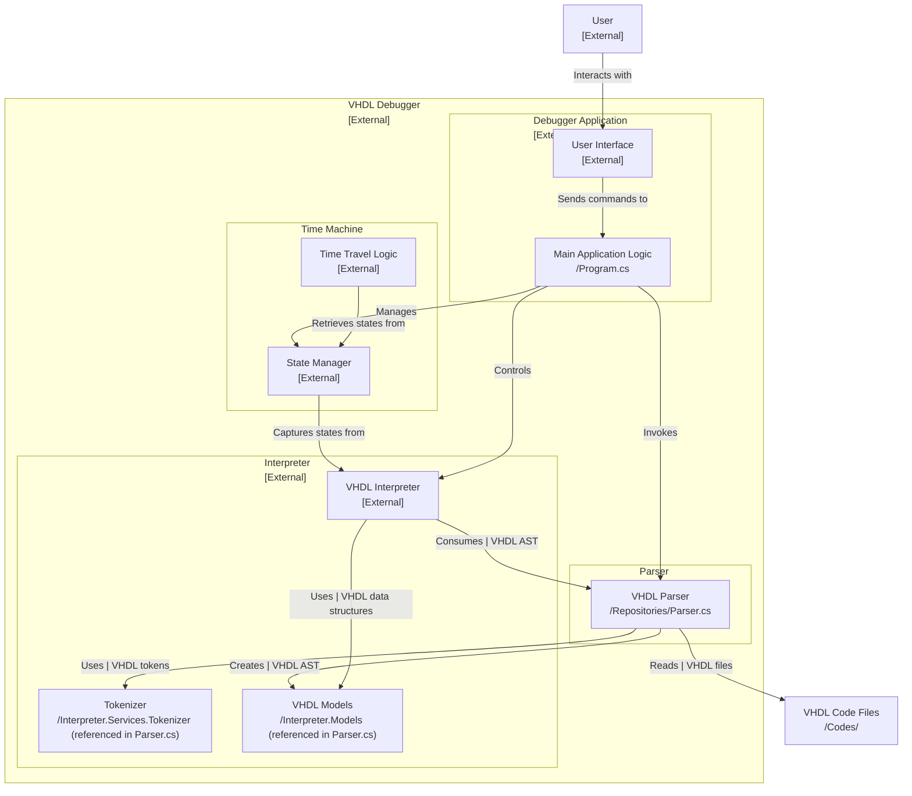

# Unnamed CodeViz Diagram

```mermaid
graph TD

    user["User<br>[External]"]
    vhdl_code["VHDL Code Files<br>/Codes/"]
    subgraph debugger_system["VHDL Debugger<br>[External]"]
        subgraph debugger_app_boundary["Debugger Application<br>[External]"]
            main_logic["Main Application Logic<br>/Program.cs"]
            ui["User Interface<br>[External]"]
            %% Edges at this level (grouped by source)
            ui["User Interface<br>[External]"] -->|"Sends commands to"| main_logic["Main Application Logic<br>/Program.cs"]
        end
        subgraph parser_boundary["Parser<br>[External]"]
            vhdl_parser["VHDL Parser<br>/Repositories/Parser.cs"]
        end
        subgraph interpreter_boundary["Interpreter<br>[External]"]
            vhdl_interpreter["VHDL Interpreter<br>[External]"]
            tokenizer["Tokenizer<br>/Interpreter.Services.Tokenizer (referenced in Parser.cs)"]
            vhdl_models["VHDL Models<br>/Interpreter.Models (referenced in Parser.cs)"]
            %% Edges at this level (grouped by source)
            vhdl_interpreter["VHDL Interpreter<br>[External]"] -->|"Uses | VHDL data structures"| vhdl_models["VHDL Models<br>/Interpreter.Models (referenced in Parser.cs)"]
        end
        subgraph time_machine_boundary["Time Machine<br>[External]"]
            state_manager["State Manager<br>[External]"]
            time_travel_logic["Time Travel Logic<br>[External]"]
            %% Edges at this level (grouped by source)
            time_travel_logic["Time Travel Logic<br>[External]"] -->|"Retrieves states from"| state_manager["State Manager<br>[External]"]
        end
        %% Edges at this level (grouped by source)
        main_logic["Main Application Logic<br>/Program.cs"] -->|"Invokes"| vhdl_parser["VHDL Parser<br>/Repositories/Parser.cs"]
        main_logic["Main Application Logic<br>/Program.cs"] -->|"Controls"| vhdl_interpreter["VHDL Interpreter<br>[External]"]
        main_logic["Main Application Logic<br>/Program.cs"] -->|"Manages"| state_manager["State Manager<br>[External]"]
        vhdl_parser["VHDL Parser<br>/Repositories/Parser.cs"] -->|"Uses | VHDL tokens"| tokenizer["Tokenizer<br>/Interpreter.Services.Tokenizer (referenced in Parser.cs)"]
        vhdl_parser["VHDL Parser<br>/Repositories/Parser.cs"] -->|"Creates | VHDL AST"| vhdl_models["VHDL Models<br>/Interpreter.Models (referenced in Parser.cs)"]
        vhdl_interpreter["VHDL Interpreter<br>[External]"] -->|"Consumes | VHDL AST"| vhdl_parser["VHDL Parser<br>/Repositories/Parser.cs"]
        state_manager["State Manager<br>[External]"] -->|"Captures states from"| vhdl_interpreter["VHDL Interpreter<br>[External]"]
    end
    %% Edges at this level (grouped by source)
    user["User<br>[External]"] -->|"Interacts with"| ui["User Interface<br>[External]"]
    vhdl_parser["VHDL Parser<br>/Repositories/Parser.cs"] -->|"Reads | VHDL files"| vhdl_code["VHDL Code Files<br>/Codes/"]

```
---
*Generated by [CodeViz.ai](https://codeviz.ai) on 11/5/2025, 6:51:24 PM*
